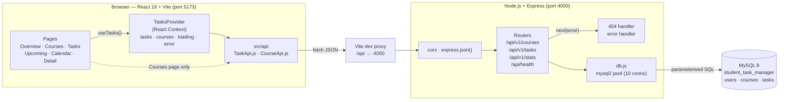
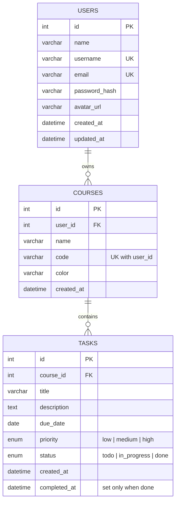

# University Student Task Manager

A web app where a student adds their courses, then tracks every assignment with
a due date and a priority, and sees at a glance what is overdue and what is due
this week.

---

## Contents

- [Tech stack](#tech-stack)
- [Architecture](#architecture)
- [Getting started](#getting-started)
- [API design](#api-design)
- [Frontend routes](#frontend-routes)
- [Project structure](#project-structure)
- [Frontend structure](#frontend-structure)
- [Backend structure](#backend-structure)
- [The shared design system](#the-shared-design-system)
- [Branching](#branching)
- [Data model](#data-model)
- [Troubleshooting](#troubleshooting)

---

## Tech stack

| Layer    | Choice                                |
| -------- | ------------------------------------- |
| Frontend | React 18 (JavaScript) + Vite          |
| Routing  | React Router 6                        |
| Styling  | Plain CSS + design tokens (see below) |
| Icons    | lucide-react                          |
| Backend  | Node.js + Express                     |
| Database | MySQL 8 (`mysql2` driver)             |

---

## Architecture

Three tiers, one direction. The browser only ever talks to the Express API, and
only the API talks to MySQL.



| Tier     | Owns                                                                  | Never does                         |
| -------- | --------------------------------------------------------------------- | ---------------------------------- |
| Frontend | Rendering, the in-memory task/course list, filtering, sorting, derived stats | Talks to MySQL, trusts its own validation |
| API      | Input validation, SQL, the completion timestamp, mapping DB errors to HTTP | Renders HTML, holds session state  |
| Database | Relationships, uniqueness, `CHECK` rules, `ON DELETE RESTRICT`         | Business rules that need "today"   |

**Why this shape.** Every rule that must never break (a course code is unique per
user, a done task has a completion time, tasks never outlive their course) lives
in the database, so a bug in the API can't violate it. Rules that need context
("due date can't be in the past") live in the API. The frontend only ever
decides how things look.

---

## Getting started

You need **Node.js 18+** and **MySQL 8** running locally.

### 1. Clone

```bash
git clone https://github.com/Sammiele224/student-task-manager.git
cd student-task-manager
```

### (2). If NO DOCKER DESKTOP INSTALLED, create the database manually; otherwise, skip this step

First, you need to install and set up MySQL 8.

Then, run the SQL script to create the database and tables:

```bash
mysql -u root -p < backend/db/schema.sql
```

Creates `student_task_manager` with the `courses` and `tasks` tables. Safe to
re-run — every statement uses `IF NOT EXISTS`.

Then, run the SQL script to seed data:

```bash
mysql -u root -p < backend/db/SeedData.sql
```
### Database made before users were added? Run the update once

`schema.sql` only creates tables that don't exist yet. It can't add the new
owner column to a `courses` table you already have, so an existing database
needs this one-time update. It keeps your courses and tasks, and gives them all
to the demo user. Run it from the project folder:

**Docker — Mac, Linux, Git Bash or Command Prompt:**

```bash
docker exec -i capstone_mysql mysql -uroot -ppassword < backend/db/migrations/001-add-users.sql
```

**Docker — PowerShell** (PowerShell has no `<`, so the file is piped in):

```powershell
Get-Content -Raw backend/db/migrations/001-add-users.sql | docker exec -i capstone_mysql mysql -uroot -ppassword
```

**Without Docker:**

```bash
mysql -u root -p < backend/db/migrations/001-add-users.sql
```

Running it twice is safe. Restart the backend afterwards.

### Database made before colours were stored as hex? Run that update too

Courses used to hold a colour *name* (`green`, `teal`, `sage`, `blue`). They now
hold the colour itself, so the stored value matches the API documentation. This
converts existing rows to the same four colours they already showed, so nothing
changes on screen. Safe to run more than once:

```bash
docker exec -i capstone_mysql mysql -uroot -ppassword < backend/db/migrations/002-course-colors-to-hex.sql
```

Without Docker:

```bash
mysql -u root -p < backend/db/migrations/002-course-colors-to-hex.sql
```

### 3. Start the backend 

```bash
cd backend
cp .env.example .env      # then fill in your MySQL password

docker-compose up -d       # only if you use Docker

npm install
npm run dev               # http://localhost:4000
```
NOTE: if you're using Docker, MySQL password in .env should be the same as `MYSQL_ROOT_PASSWORD` in `docker-compose.yml`. 

Check it worked: <http://localhost:4000/api/health> returns
`{"status":"ok","database":"connected"}`.

### 4. Start the frontend

In a second terminal:

```bash
cd frontend
npm install
npm run dev               # http://localhost:5173
```

Vite proxies every `/api/*` request to the backend on port 4000, so frontend
code just calls `fetch('/api/v1/courses')` — no host, no CORS handling.

> One file still breaks this: `src/api/CourseApi.js` hard-codes
> `http://localhost:4000`, so it bypasses the proxy and leans on the backend's
> CORS allowance. It works locally and breaks anywhere else. New code should use
> a relative path, the way `TaskApi.js` does.

### Commands

| Where      | Command         | What it does                   |
| ---------- | --------------- | ------------------------------ |
| `frontend` | `npm run dev`   | Dev server with hot reload     |
| `frontend` | `npm run build` | Production build into `dist/`  |
| `frontend` | `npm run lint`  | ESLint                         |
| `backend`  | `npm run dev`   | API server, restarts on save   |
| `backend`  | `npm start`     | API server, no watch           |

---

## API design

REST over JSON. Resources are plural nouns, the HTTP verb is the action, and
everything is mounted under **`/api/v1`** so a breaking change can ship as `v2`
beside it. `/api/health` is the one exception — it sits outside the version
prefix.

### Inventory

| Method   | Path                          | Purpose                                   | Body                                                      | Success | Errors |
| -------- | ----------------------------- | ----------------------------------------- | --------------------------------------------------------- | ------- | ------ |
| `GET`    | `/api/v1/courses`             | List courses with `taskCount` + `completedTaskCount` | —                                              | 200     | 500    |
| `POST`   | `/api/v1/courses`             | Create a course                           | `name`\*, `code`\*, `color`                               | 201 + course | 400 missing field, 409 duplicate code |
| `PUT`    | `/api/v1/courses/:id`         | Replace a course                          | `name`\*, `code`\*, `color`\*                             | 200 + course | 400, 404, 409 |
| `DELETE` | `/api/v1/courses/:id`         | Delete a course **and all its tasks**     | —                                                         | 200 + `{id, deletedTaskCount}` | 404 |
| `GET`    | `/api/v1/tasks`               | List tasks joined with their course       | query: `search`, `courseId`, `status`, `priority`, `sort` (`dueDate`\|`priority`\|`createdAt`), `order` (`asc`\|`desc`) | 200 | 500 |
| `GET`    | `/api/v1/tasks/:id`           | One task                                  | —                                                         | 200     | 404    |
| `POST`   | `/api/v1/tasks`               | Create a task                             | `courseId`\*, `title`\*, `dueDate`\*, `description`, `priority`, `status` | 201 + the saved task | 400 missing field, bad date, bad priority/status, unknown course |
| `PUT`    | `/api/v1/tasks/:id`           | Replace a task                            | all six fields required                                   | 200 + the saved task | 400, 404 |
| `PATCH`  | `/api/v1/tasks/:id/status`    | Change status only                        | `status`\*                                                | 200 + the saved task | 400 invalid status, 404 |
| `DELETE` | `/api/v1/tasks/:id`           | Delete a task                             | —                                                         | 200     | 404    |
| `GET`    | `/api/v1/stats`               | Dashboard numbers                         | —                                                         | 200     | 500    |
| `GET`    | `/api/health`                 | Server + database check                   | —                                                         | 200     | 503 database unreachable |

\* required

### Design decisions

- **`PATCH /tasks/:id/status` exists beside `PUT`.** Ticking a checkbox is the
  most common write in the app. A dedicated endpoint means the client sends one
  field instead of re-sending the whole task, and the server alone decides the
  completion timestamp.
- **The server owns `completed_at`.** Both `PUT` and `PATCH` set it with the same
  SQL `CASE`: stamped the first time a task becomes `done`, kept if it is already
  done, cleared when it leaves `done`. The client never sends it.
- **Every task write answers with the saved task**, read back through one
  `TASK_SELECT`, so create, replace and status all return the same shape as a
  read. Clients can merge the response instead of reloading the list.
- **Task reads join the course.** `courseName`, `courseCode` and `courseColor`
  arrive on every task, so a task row can render without a second request.
- **`isOverdue` is computed in SQL** (`due_date < CURDATE() AND status != 'done'`)
  so every client gets the same answer.
- **Database errors become HTTP errors.** `ER_DUP_ENTRY` → 409,
  `ER_NO_REFERENCED_ROW_2` → 400 "courseId does not exist". Anything else goes
  to the error handler as a 500.

### Example: create a task

```http
POST /api/v1/tasks
Content-Type: application/json

{ "courseId": 2, "title": "Lab report 3", "dueDate": "2026-09-22",
  "priority": "high", "description": "Sections 1–4" }
```

```json
201 Created
{ "success": true, "data": {
  "id": 41, "courseId": 2, "courseName": "Database Systems", "courseCode": "CS202",
  "courseColor": "#38846B", "title": "Lab report 3", "description": "Sections 1–4",
  "dueDate": "2026-09-22", "priority": "high", "status": "todo", "isOverdue": false,
  "createdAt": "2026-09-18T17:45:00+07:00", "completedAt": null
} }
```

Every task write — create, replace, status — answers with the task in this same
shape, so a client never has to guess what was saved.

### Response envelope

Every route under `/api/v1` wraps its payload:

```json
{ "success": true, "data": [ ... ] }
{ "success": true, "message": "Task updated successfully" }
{ "success": false, "message": "Course not found." }
```

The two server-level handlers are the exception — an unmatched path and an
unhandled throw both answer `{ "error": "..." }`, without `success`.

### Conventions

| Thing             | Convention                                                      |
| ----------------- | --------------------------------------------------------------- |
| **Dates**         | ISO `YYYY-MM-DD` everywhere — request, response, database         |
| **Field names**   | `camelCase` in JSON (`courseId`, `dueDate`), `snake_case` in SQL |
| **Priority**      | `"low"` \| `"medium"` \| `"high"`                                |
| **Status**        | `"todo"` \| `"in_progress"` \| `"done"`                          |
| **Errors**        | Non-2xx with `{ "success": false, "message": "..." }` from a route; `{ "error": "..." }` from the server's 404 and error handlers |
| **Overdue**       | `due_date < today AND status != 'done'`                          |
| **Due this week** | `due_date` in the current Monday–Sunday week and `status != 'done'` (`YEARWEEK(…, 1)`) |
| **Upcoming**      | Frontend only: `due_date` from today to 7 days ahead, not done  |

### `GET /api/v1/stats` response shape

```json
{
  "success": true,
  "data": {
    "totalTasks": 35,
    "completedCount": 22,
    "overdueCount": 3,
    "dueThisWeekCount": 8,
    "completionRate": 62
  }
}
```

---

## Frontend routes

| Path         | Page        |
| ------------ | ----------- |
| `/`          | Overview    |
| `/dashboard` | → redirects to `/` |
| `/courses`   | My courses  |
| `/tasks`     | All tasks   |
| `/tasks/:id` | Task detail |
| `/upcoming`  | Upcoming    |
| `/calendar`  | Calendar    |
| `/profile`   | Profile     |
| `/signin`    | Sign in — renders outside `AppLayout`, so no sidebar or topbar |
| anything else | Not found  |

---

## Project structure

```
student-task-manager/
├── frontend/
│   └── src/
│       ├── api/             CourseApi.js, TaskApi.js — every fetch lives here
│       ├── components/
│       │   ├── ui/          Button, IconButton, Input, Select, Card, Badge  ← reuse these
│       │   ├── layout/      AppLayout, Sidebar, Topbar, PageContainer, PageHeader
│       │   └── features/    Courses/, Tasks/, Calendar/, Overview/ — page-specific parts
│       ├── pages/           One file per route
│       ├── hooks/           Shared hooks (useClickOutside)
│       ├── styles/          tokens.css + global.css, then features/ per area
│       ├── theme/           Light / Cyber theme provider
│       ├── App.jsx          Route table
│       └── main.jsx         Entry point
│
└── backend/
    ├── db/
    │   ├── schema.sql       Tables (run this first)
    │   ├── SeedData.sql     Demo data
    │   └── migrations/      One-time updates for databases made before a change
    └── src/
        ├── routes/          courses.js, tasks.js, stats.js
        ├── server.js        Express app — add routers here
        └── db.js            Shared MySQL connection pool
```

---

## Frontend structure

### Layers

```
main.jsx            StrictMode → ThemeProvider → BrowserRouter → App
  App.jsx           TasksProvider wraps every route
    pages/          One component per route. Owns modal/dialog state only.
    components/
      features/     Domain parts: TaskListPanel, TaskRow, CourseCard, MonthGrid…
      layout/       App shell: AppLayout, Sidebar, Topbar, GlobalSearch, PageHeader
      ui/           Design system: Button, Input, Select, Card, Badge, Modal…
    api/            The only files that call fetch()
    hooks/          useBackendStatus, useClickOutside
    theme/          Light / Cyber
```

Imports only point downward: a page may use features, layout and ui; a feature
component may use ui; `ui/` imports nothing app-specific. That keeps the design
system reusable and stops a button from knowing what a task is.

### Routing

`App.jsx` holds the whole route table (React Router 6). Every page except
`/signin` is nested under `<AppLayout>`, which renders the sidebar and topbar
once and swaps the page into its `<Outlet />`. The topbar breadcrumb is derived
from the path. `/calendar?date=YYYY-MM-DD` opens the calendar on a given day,
which is how the Overview week strip links into it.

### Component hierarchy

```
App
└── TasksProvider
    ├── SignIn
    └── AppLayout
        ├── Sidebar ─── Logo, NavLinks, progress ring, ThemeToggle, UserMenu, GuidancePanel
        ├── Topbar ──── GlobalSearch, UserMenu
        └── <Outlet>
            ├── Overview ──── HeroPanel, StatCard ×4, CourseCard, TaskRow, WeekPanel, FocusPanel
            ├── Courses ───── CoursesToolbar, SemesterPicker, CourseCard, Create/EditCourseModal, DeleteConfirmDialog
            ├── CourseDetail  CourseProgressPanel, TaskListPanel, EditCourseModal
            ├── Tasks ─────── TaskListPanel ── TaskRow / TaskCard (board) ── StatusSelect, Badge
            ├── Upcoming ──── horizon banner, tabs, TaskListPanel
            ├── Calendar ──── MonthGrid, DayPanel ── TaskDateItem
            ├── TaskDetail ── StatusSelect, EditTaskModal
            └── Profile, NotFound
```

Pages that list tasks share **`TaskListPanel`** (search, filters, sort, list vs
board view, pagination) and the same trio of dialogs: `CreateTaskModal`,
`EditTaskModal` (both wrap `BodyTaskForm`) and `TaskMessageDialog`.

### State management

| State                                   | Owner                       | Why there                                    |
| --------------------------------------- | --------------------------- | -------------------------------------------- |
| `tasks`, `courses`, `loading`, `error`  | `TasksProvider` (Context)   | Read by the sidebar, search and five pages at once |
| Derived figures (overdue, this week, % done, course progress) | computed with `useMemo` / `taskStats.js` | Never stored, so they can't go stale |
| Filters, sort, page number, view mode   | `TaskListPanel` local state | Only that panel cares                        |
| Which modal is open, the task being edited | Each page, `useState`    | UI-only                                      |
| Theme                                   | `ThemeProvider` + `localStorage` | Survives reloads                        |
| Selected day / month                    | `Calendar`, seeded from `?date=` | Linkable                                |

No Redux: one shared list and a handful of writes don't need it. Context plus
derived values keeps a single source of truth — mark a task done on the
calendar and the sidebar ring, dashboard cards and Upcoming count all move,
because they all read the same array.

### API integration

1. Pages never call `fetch`. They call context actions (`addTask`,
   `updateTask`, `setTaskStatus`, `deleteTask`), which call `src/api/*.js`.
2. `TaskApi.readResponse` unwraps `{ success, data }` and throws an `Error`
   with the server's `message` on failure; the context stores it in `error`
   and pages show it above the list.
3. On mount the provider loads tasks and courses in parallel
   (`Promise.all`).
4. **Status change and delete are optimistic**: the list updates immediately
   and rolls back to the previous array if the request fails.
5. **Create and full update refetch** the list. The API now answers with the
   saved task, so these could merge the response instead — a worthwhile
   simplification once someone has time to re-check the sort order.
6. Search and filters run **in the browser** over the loaded list, so every
   page sees the full list and typing costs no requests. The API also supports
   `?search=&status=…` for when the list is too large to load at once.
7. `useBackendStatus` polls `/api/health` every 30 s; the sidebar warns when
   the campus is offline.

### Conventions

- One component per file, PascalCase; helpers in camelCase `.js` beside the
  components that use them (`taskMeta.js`, `calendarGrid.js`).
- Each component imports its own CSS; colours come from `tokens.css` only.
- Dates stay `YYYY-MM-DD` strings end to end.

---

## Backend structure

```
backend/src/
├── server.js         builds the app: cors → json → routers → 404 → error handler
├── db.js             one mysql2 pool shared by every route
└── routes/
    ├── courses.js    CRUD + task counts
    ├── tasks.js      CRUD, status PATCH, search / filter / sort
    └── stats.js      dashboard aggregates
```

### Request lifecycle

```
request
  → cors()            only the Vite origin may call
  → express.json()    body parsed into req.body
  → router handler    validate → parameterised SQL → shape the row → respond
       └─ throws → next(error)
  → 404 handler       no route matched            { error: "Not found" }
  → error handler     anything unhandled          { error: message }, 500
```

### Business logic organisation

The app is small, so each router file holds its handlers directly — there is no
separate service or repository layer yet. Business logic sits in three places:

| Where        | Example                                                          |
| ------------ | ---------------------------------------------------------------- |
| Handler      | required-field checks, sort whitelist, status whitelist          |
| SQL          | `isOverdue`, stats aggregates, the `completed_at` `CASE`         |
| Schema       | `UNIQUE`, `CHECK`, `ON DELETE RESTRICT`                          |

When a router grows past a few hundred lines, the next step is to pull SQL into
`src/repositories/` and keep handlers to validation and HTTP.

### Validation strategy — three layers

1. **Frontend forms** (`BodyTaskForm`, `BodyCourseForm`) — required fields,
   friendly messages. Convenience only; never trusted.
2. **API handlers** — required fields, `status` whitelist on PATCH, `sort`
   mapped through a whitelist object so it can never inject SQL, strings
   trimmed.
3. **Database** — `CHECK` constraints reject blank names, `ENUM` rejects
   unknown priorities and statuses, foreign keys reject unknown courses.

All values go through `pool.query(sql, params)` placeholders; nothing is
concatenated into SQL.

### Error handling

| Situation                     | Response                                              |
| ----------------------------- | ----------------------------------------------------- |
| Missing / invalid input       | 400 `{ success: false, message }`                     |
| Row not found (`affectedRows === 0`) | 404 `{ success: false, message }`              |
| Duplicate course code         | 409 from `ER_DUP_ENTRY`                               |
| Unknown `courseId` on a task  | 400 from `ER_NO_REFERENCED_ROW_2`                     |
| Anything else                 | `next(error)` → logged, 500 `{ error }`               |
| MySQL down at boot            | Server logs the cause and exits                       |
| MySQL down at runtime         | `/api/health` answers 503                             |

### CRUD, end to end — "mark a task done"

```
TaskRow checkbox
  → toggleDone(id)                        TaskContext
  → tasks updated immediately             optimistic
  → PATCH /api/v1/tasks/7/status {done}   TaskApi.updateTaskStatus
  → status whitelisted                    tasks.js
  → UPDATE tasks SET completed_at = CASE … , status = ? WHERE id = ?
  → chk_tasks_completion passes           MySQL
  → 200 { success: true }
  (on failure: restore previous array, show message)
```

---

## The shared design system

**Reuse these components. Please do not hand-roll buttons, inputs or card
surfaces** — if something is missing, extend the shared component so everything
stays consistent.

### Components

```jsx
import { Button, IconButton, Input, Select, Card, Badge } from '../components/ui'
import { PageContainer, PageHeader } from '../components/layout'
```

| Component | Key props                                                                 |
| --------- | ------------------------------------------------------------------------- |
| `Button`  | `variant` `primary\|secondary\|ghost\|danger`, `size` `sm\|md\|lg`, `iconLeft`, `iconRight`, `loading`, `fullWidth`, `as` |
| `Input`   | `label`, `hint`, `error`, `required`, `optional`, `icon`, `as="textarea"`  |
| `Select`  | `label`, `options={[{value,label}]}`, `placeholder`, `error`, `required`   |
| `Card`    | `eyebrow`, `title`, `action`, `footer`, `padding` `none\|sm\|md\|lg`, `tone` `default\|subtle\|outline`, `hoverable` |
| `Badge`   | `tone` `neutral\|green\|high\|medium\|low\|overdue\|done`, `dot`, `dotColor` |

`Badge` carries the status colours: `overdue` and `high` are red, `medium`
amber, `low` and `done` green. Leave `tone` off and it reads the child text —
`"high"`, `"todo"`, `"in_progress"` and friends all map to the right tone.

### What a page looks like

Every page follows the same skeleton — this is what keeps the app feeling like
one product:

```jsx
import { Plus } from 'lucide-react'
import { Button, Card } from '../components/ui'
import { PageContainer, PageHeader } from '../components/layout'

export default function Courses() {
  return (
    <PageContainer>
      <PageHeader
        eyebrow="Your academic world"
        title="A home for every course."
        subtitle="Keep your subjects organized."
        actions={<Button iconLeft={<Plus />}>New course</Button>}
      />

      <Card title="Software Engineering" eyebrow="CS301">
        ...
      </Card>
    </PageContainer>
  )
}
```

### Adding a page

Three edits, nothing else:

1. Create `src/pages/YourPage.jsx`.
2. Add a `<Route>` in `src/App.jsx`.
3. Add an entry to `NAV_ITEMS` in `src/components/layout/Sidebar.jsx`.

### Colours and spacing

`src/styles/tokens.css` is the single source of truth. **Never hard-code a
colour** — use the variable and both themes work for free:

```css
.my-thing {
  background: var(--surface);
  border: 1px solid var(--line);
  color: var(--ink);
  padding: var(--space-4);
  border-radius: var(--radius-lg);
}
```

| Purpose             | Variable                                                      |
| ------------------- | ------------------------------------------------------------- |
| Surfaces            | `--bg` (page), `--surface` (card), `--sidebar`, `--input`      |
| Text                | `--ink`, `--subtle`, `--muted`, `--faint` — darkest to lightest |
| Text on a fill      | `--on-primary`, `--on-danger`, `--inverse`                     |
| Brand action        | `--green`, `--green-hover`, `--green-soft`                     |
| Secondary accent    | `--accent`, `--accent-soft` — a different hue, not the brand   |
| Status              | `--danger`, `--warning`, `--success`, `--neutral` (+ each `-bg` and `-line`) |
| Course colours      | Stored per course as `#RRGGBB`, not tokens — see [Data model](#data-model) |
| Lines               | `--line`, `--line-strong`                                      |
| Hero / overlay      | `--hero-base`, `--hero-accent`, `--overlay`, `--photo-scrim`   |
| Elevation           | `--shadow-sm\|md\|lg`, `--focus-ring`                          |
| Type                | `--font-display`, `--font-sans`, `--text-xs` … `--text-4xl`    |
| Spacing             | `--space-1` … `--space-16`                                     |
| Radii               | `--radius-sm\|md\|lg\|xl\|pill`                                |

Two pairs are easy to mix up:

- **`--green` is the brand; `--accent` is not.** The brand green drives buttons,
  links and active nav. `--accent` is a separate hue that reads purple in Cyber,
  so reaching for it to mean "our colour" breaks the dark theme. Soft brand
  backgrounds are `--green-soft`, not `--accent-soft`.
- **Status fills end in `-bg`, status borders in `-line`** — `--danger-bg` behind
  `--danger` text, never `--danger` as a background.

### Themes

Two themes: **Light** (soft green-tinted white, forest green) and **Cyber**
(near-black, mint). The switch is at the bottom of the sidebar. It follows the
operating system preference until someone picks one, then remembers it.

`data-theme` on `<html>` is either `light` or `cyber`; `tokens.css` also
answers to `dark` as an alias so a token block works either way.

Because everything reads from tokens, you never write theme-specific CSS.

> **Styling approach is not final.** Plain CSS keeps the door open — the token
> palette maps directly onto a Tailwind theme config later, and only component
> files would change.

---

## Branching

`main` is protected: no direct pushes, and every pull request needs one
approving review before it can merge.

```bash
git checkout main
git pull
git checkout -b feature/task-create

# ...work, commit...

git push -u origin feature/task-create
```

Then open a pull request.

Branch names: `feature/<short-description>`, or `fix/<short-description>` for a
bug.

Before opening a pull request:

- `npm run lint` passes in `frontend`
- `npm run build` passes in `frontend`
- No hard-coded colours — tokens only
- Checked in both Light and Cyber themes
- No `.env` or credentials committed

---

## Data model

One user has many courses, and one course has many tasks. A task belongs to a
user through its course, so `tasks` has no `user_id` of its own.



Indexes on `tasks`: `(course_id, due_date)` for a course's list,
`due_date` for upcoming/overdue, `status` for filters and the dashboard.

**users** — `id`, `name`, `username` *(unique)*, `email` *(unique)*,
`password_hash`, `avatar_url`, `created_at`, `updated_at`

**courses** — `id`, `user_id` *(FK → users.id)*, `name`, `code` *(unique per
user)*, `color` *(a `#RRGGBB` string, as the API documentation specifies)*,
`created_at`

**tasks** — `id`, `course_id` *(FK → courses.id)*, `title`, `description`,
`due_date`, `priority` *(low | medium | high)*, `status` *(todo | in_progress |
done)*, `created_at`, `completed_at`

Two rules are enforced by the database itself, so they hold even if an
application-level check is missed:

- `(courses.user_id, courses.code)` is `UNIQUE` — one student can't have the
  same code twice, but two students can each have a CS201.
- `users.email` and `users.username` are `UNIQUE`. Email comparison ignores
  case, so `Alex@school.edu` and `alex@school.edu` are the same account.
- `tasks.course_id` uses `ON DELETE RESTRICT` — a plain `DELETE FROM courses`
  on a course that still has tasks fails rather than silently destroying them.
  `DELETE /api/v1/courses/:id` removes the tasks on purpose: it deletes them and
  then the course inside one transaction, so either both go or neither does. The
  UI warns how many tasks will be deleted before it asks.
- `courses.user_id` uses `ON DELETE RESTRICT` too — a user who still has courses
  can't be deleted.

> **The database doesn't keep users apart — the API has to.** Every query for
> courses must filter on the signed-in user's `courses.user_id`, and every query
> for tasks must join their course and filter the same way. Nothing stops one
> user's request reading another user's rows if a query forgets.

`users.password_hash` holds a **bcrypt** hash, never the password itself. The
demo data creates one account for development: `alex@school.edu` with password
`password123`. It owns every demo course.

> Validation such as "due date cannot be in the past" belongs in the
> `POST /api/v1/tasks` handler, not the database — `SeedData.sql` inserts
> directly and must be able to create overdue rows for testing.

---

## Troubleshooting

**`Could not connect to MySQL`**
MySQL isn't running, or `backend/.env` is wrong. Check the service is up and
that `DB_USER` / `DB_PASSWORD` match your local install.

**`ER_BAD_DB_ERROR: Unknown database`**
You haven't created the schema yet — run step 2 of Getting started.

**`Unknown column 'user_id'` or `Table 'student_task_manager.users' doesn't exist`**
Your database was made before users were added. Run the one-time update in
Getting started.

**`Field 'user_id' doesn't have a default value` when creating a course**
Every course needs an owner, and the request didn't send one. The courses API
has to insert the signed-in user's id.

**Frontend calls return 404 or HTML instead of JSON**
The backend isn't running — start it on port 4000, where the Vite proxy expects
it. If the server *is* up, check the path: routes live under `/api/v1/...`, and
`/api/courses` without the version prefix returns the 404 handler's
`{ "error": "Not found" }`.

**Dates arrive as `2026-09-07T00:00:00.000Z` instead of `2026-09-07`**
The pool sets `dateStrings: true`, so MySQL returns plain `YYYY-MM-DD`. If you
see a timestamp, something wrapped the value in `new Date()` — don't.

**`Cannot delete or update a parent row: a foreign key constraint fails` when deleting a course**
That is `ON DELETE RESTRICT` catching a delete that skipped the course's tasks.
Delete through `DELETE /api/v1/courses/:id`, which removes the tasks first in the
same transaction.

**Styles look unstyled or colours are wrong**
Make sure your component imports its own `.css` file, and that you're using token
variables rather than literal hex values.
